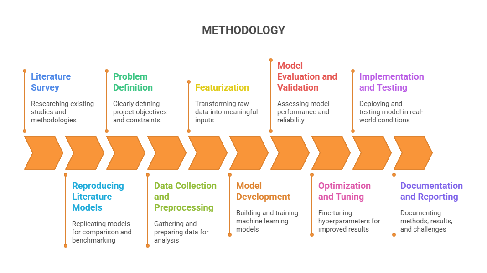
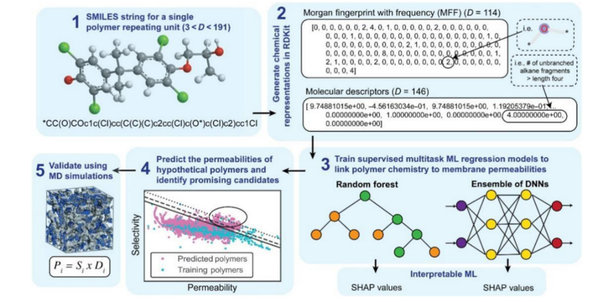

# 🧠 Membrane Design Using Machine Learning

## 📍 About the Project

This project leverages Machine Learning (ML) to accelerate the design and screening of polymer membranes for efficient gas separation. By modeling relationships between molecular structure, temperature, pressure, and gas permeability/selectivity, we aim to create a scalable tool to assist researchers in identifying promising materials faster and more reliably.

---

## 🎯 Objectives

- 📊 Collect and preprocess polymer membrane datasets.
- 🛠️ Develop ML models to predict gas permeability and selectivity.
- 🧪 Evaluate and optimize models based on performance metrics.
- 📈 Rank polymer membranes for specific gas separation tasks (e.g., CO₂/CH₄, CO₂/N₂).

---

## 🔬 Methodology

### Overall Workflow

1. **SMILES string for a single polymer repeating unit**  
   Encode polymer chemistry using SMILES.
2. **Generate chemical representations in RDKit**  
   Extract Morgan fingerprints and molecular descriptors.
3. **Train supervised multitask ML regression models**  
   Use methods like Random Forest and DNNs, with SHAP for interpretability.
4. **Predict permeability and identify candidates**  
   Screen hypothetical polymers and rank by ML-predicted properties.
5. **Validate using MD simulations**  
   Confirm top candidates with molecular dynamics.

---

### Step-by-Step Methodology

- **Literature Survey:** Researching existing studies and methodologies.
- **Problem Definition:** Defining project objectives and constraints.
- **Featurization:** Transforming raw data into meaningful inputs.
- **Model Evaluation and Validation:** Assessing model performance and reliability.
- **Implementation and Testing:** Deploying/testing in real-world conditions.
- **Reproducing Literature Models:** Benchmarking against prior work.
- **Data Collection and Preprocessing:** Gathering/cleaning data for analysis.
- **Model Development:** Building and training ML models.
- **Optimization and Tuning:** Hyperparameter tuning for improved results.
- **Documentation and Reporting:** Documenting methods, results, challenges.

---

## 📌 Key Results

| Model           | R² Score (Test) | MAPE (%) | Notes                                      | 
|-----------------|----------------|----------|---------------------------------------------|
| ANN (3 Layers)  | 0.90           | 65.09    | Early stopping & dropout to reduce overfit  |
| DNN             | 0.847          | 94.64    | Deeper architecture, moderate performance   |
| GNN             | 0.78           | 72.42    | Explored graph-based structure              |
| GPR + GridSearch| 0.86           | 141.6    | Best generalization, interpretable          |
| Random Forest   | 0.85           | 146.34   | Fast, non-parametric                        |
| XGBoost         | 0.83           | 171.74   | Accurate, struggled with extreme values     |

- Optuna and Grid Search CV significantly improved model performance.
- Achieved R² = 0.90 with ANN using tuned dropout and early stopping.
- GPR showed strong performance and interpretability.
- Ranked polymers by ML-predicted permeability and selectivity.
- Reference datasets included fingerprint-based representations from RDKit.

---

## 🚀 Outcomes

- A generalized ML model capable of predicting gas separation performance for novel polymers.
- Ranked recommendation system for identifying membrane materials for industrial gas separation.
- Real-world impact in sustainable energy and environmental protection.

---

## 📚 Literature Referenced

- Yin et al., *Green Energy and Environment*, 2024 – Accelerating discovery via ML
- Tiwari et al., *Journal of Chemical Information and Modeling*, 2024 – Polymer dataset creation and screening
- Zhonglin et al., *Nano Letters*, 2024 – AI-guided optimization in membrane design

---

## 🏛️ Conference Presentation

Presented as a Poster at the GCDI 2025 Conference (March 6–8).  
A detailed report is available in this repository.

